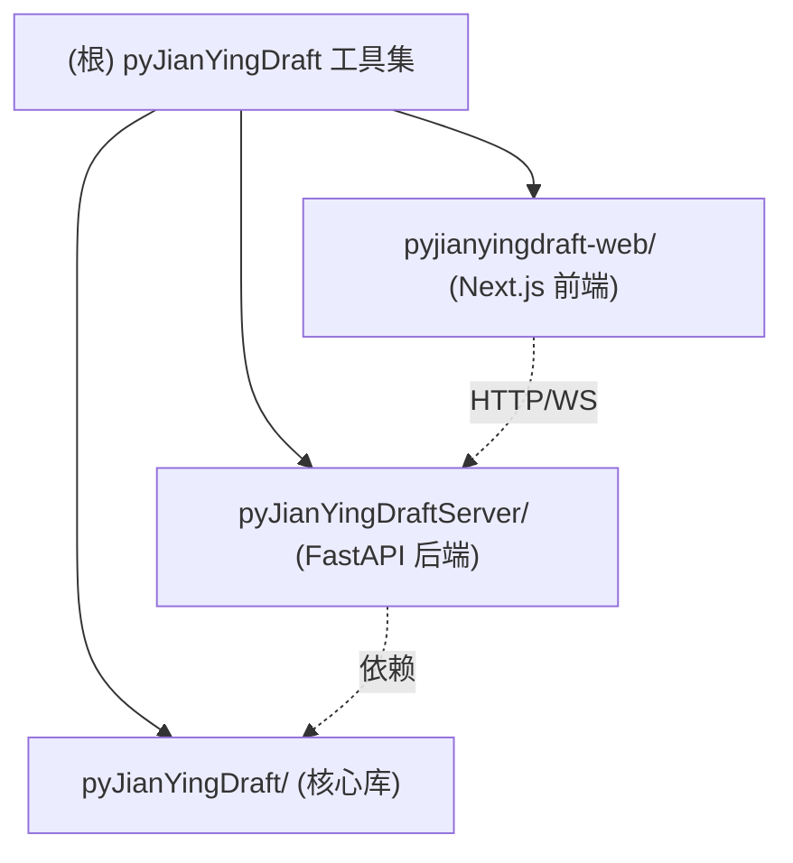

# CLAUDE.md

## 项目简单介绍

pyJianYingDraft 是一个完整的剪映（JianYing/CapCut）草稿文件（`draft_content.json`）编程工具集，覆盖"生成 / 加载模板 / 服务化 / 可视化"全链路。仓库由三个独立但相互依赖的子项目组成：核心 Python 库（`pyJianYingDraft/`）、FastAPI 后端（`pyJianYingDraftServer/`）、Next.js 前端（`pyjianyingdraft-web/`）。

核心能力：编程生成剪映草稿（音视频/文本/特效/转场/关键帧/动画）、模板模式加载现有草稿并替换素材与文本、Windows 下通过 UI 自动化批量导出视频（仅剪映 ≤6.x）。

关键技术栈：Python 3.8/3.11 + pymediainfo/imageio/uiautomation、FastAPI + SQLite + Aria2、Next.js 15 + React 19 + HeroUI + Tailwind v4 + CodeMirror + 时间轴编辑器。

## 约定的规则

- 时间系统：内部统一用微秒 `int`，`SEC = 1000000`；`tim("1.5s")` 转微秒；`trange(start, duration)` 第二个参数是**持续时长**，不是结束时间。
- 主视频轨道（最底层）片段必须从 `0s` 开始，否则剪映强制对齐。
- 模板模式仅支持剪映 **≤ 5.9**（6+ 文件加密）；自动导出仅支持剪映 **≤ 6.x**（7+ 隐藏控件）。
- 类名 PascalCase；保留 snake_case 旧别名（如 `Script_file`）但触发 `DeprecationWarning`。
- 链式调用：大多数核心库方法返回 `self`。
- 后端开发模式必须禁用 `--reload`（防止多个 aria2c 进程冲突），入口为 `app.main:app`。
- 路径使用 `os.path.join()` 跨平台；Windows 路径用原始字符串。
- 不要修改根日志配置（与 uvicorn 冲突）；用 `print()` + `sys.stdout.flush()`。
- 更多规则见 [约定详情](claude/conventions.md)。

## 文件索引

| 文件 | 用途 | 何时阅读 |
| --- | --- | --- |
| [架构总览](claude/overview.md) | 三模块关系、运行时形态、设计取舍 | 第一次接手项目 |
| [约定详情](claude/conventions.md) | 命令、风格、兼容性、注意事项细则 | 写代码前 |
| [模块职责](claude/module-responsibilities.md) | 三个子项目的职责与边界 | 规划跨模块改动 |
| [入口与启动](claude/entrypoints.md) | 各模块入口文件、启动/构建流程 | 跑起来或排错 |
| [对外接口](claude/public-interfaces.md) | 后端 REST/WebSocket、前端路由、SDK 导出 | 调用接口 |
| [依赖与配置](claude/dependencies-and-config.md) | 关键依赖、版本差异、配置文件 | 升级或环境问题 |
| [数据模型](claude/data-model.md) | 核心类层次、SQLite 表、规则组结构 | 设计数据流 |
| [测试与质量](claude/testing-and-quality.md) | 测试命令、覆盖情况、质量风险 | 验证改动 |
| [文件地图](claude/file-map.md) | 重要目录与关键文件清单 | 找文件 |
| [常见问题](claude/faq.md) | 高频陷阱及定位路径 | 排错 |
| [变更记录](claude/changelog.md) | 索引生成/更新记录 | 看历史 |

## 模块索引

| 模块路径 | 职责摘要 | 文档 |
| --- | --- | --- |
| `pyJianYingDraft/` | 核心 Python 库：草稿生成、模板模式、UI 自动化导出 | [CLAUDE.md](pyJianYingDraft/CLAUDE.md) |
| `pyJianYingDraftServer/` | FastAPI 后端：REST/WebSocket、Aria2 异步下载、SQLite 任务持久化 | [CLAUDE.md](pyJianYingDraftServer/CLAUDE.md) |
| `pyjianyingdraft-web/` | Next.js + React 19 前端：时间轴编辑器、规则组、下载管理 | [CLAUDE.md](pyjianyingdraft-web/CLAUDE.md) |

## 扫描状态

- 更新时间：2026-06-24 09:19:30
- 已扫描：根配置 + 核心库全部 17 个 `.py` + metadata 目录 + Server `app/` 全部路由/服务/模型 + main.py + run.py + Web 入口与组件清单。
- 跳过：`node_modules/`、`.venv/`、`venv/`、`out/`、`dist/`、`build/`、`.heroui-docs/`（HeroUI 文档示例，非业务代码）、二进制文件。
- 注意事项：根级旧 `CLAUDE.md` 提到 web 模块含 `electron/`，实际仓库当前**无 `electron/` 目录**，且 Web App Router 实际路由为 `/`、`/editor`、`/downloads`、`/api/open-in-editor`，以本次扫描为准。
- 下一步建议深挖：核心库各 `*_segment.py` 的具体参数与导出 JSON 结构、Server 各 router 的请求/响应 schema、Web `src/components/timeline-editor/` 内部状态管理细节。
